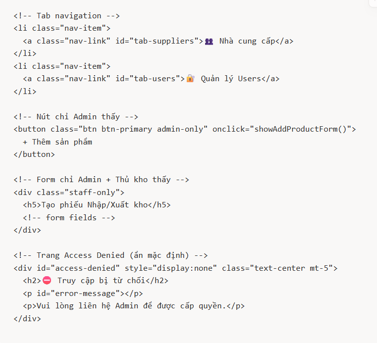

## Bài 2: Hệ thống Quản lý Kho hàng ⭐⭐⭐

> ⏱ Thời gian ước tính: 120 phút**Kiến thức áp dụng:** CRUD operations, multi-sheet database, auto-calculate, email notification, form validation, Google Charts, Bootstrap, server-side include, **phân quyền người dùng (RBAC)**

### Bối cảnh thực tế

Một cửa hàng kinh doanh thiết bị văn phòng cần một hệ thống web đơn giản để quản lý nhập/xuất kho, theo dõi tồn kho theo thời gian thực, quản lý nhà cung cấp, tự động cảnh báo khi hàng sắp hết, và **phân quyền truy cập** cho từng nhân viên.

### Thiết kế Database (Google Sheets)

Tạo một Google Sheets với **7 sheet tabs** như sau:

### Sheet 1: `Categories` — Danh mục sản phẩm

| =Cat_ID= | =Cat_Name=          | =Description=                   |
| -------- | ------------------- | ------------------------------- |
| =CAT001= | =Văn phòng phẩm= | =Bút, giấy, kẹp, ghim...=    |
| =CAT002= | =Thiết bị IT=     | =Laptop, chuột, bàn phím...= |
| =CAT003= | =Nội thất=        | =Bàn, ghế, tủ...=            |
| =CAT004= | =Thiết bị in ấn= | =Máy in, mực in, giấy in...= |


**Sheet 2:** **Suppliers**— Nhà cung cấp


| =Supplier_ID= | =Supplier_Name=         | =Contact_Person= | =Phone=      | =Email=                                        | =Address=             |
| ------------- | ----------------------- | ---------------- | ------------ | ---------------------------------------------- | --------------------- |
| =SUP001=      | =Công ty Thiên Long=  | =Nguyễn Văn A= | =0901111111= | =[order@thienlong.vn](mailto:order@thienlong.vn)= | =Q.Tân Phú, TP.HCM= |
| =SUP002=      | =Phong Vũ Trading=     | =Trần Thị B=   | =0902222222= | =[sales@phongvu.vn](mailto:sales@phongvu.vn)=     | =Q.10, TP.HCM=        |
| =SUP003=      | =Nội thất Hòa Phát= | =Lê Văn C=     | =0903333333= | =[info@hoaphat.com](mailto:info@hoaphat.com)=     | =Q.12, TP.HCM=        |


**Sheet 3: ****Products**

 — Sản phẩm


| =Product_ID= | =Product_Name=              | =Cat_ID= | =Supplier_ID= | =Unit= | =Unit_Price= | =Min_Stock= |
| ------------ | --------------------------- | -------- | ------------- | ------ | ------------ | ----------- |
| =SP001=      | =Bút bi Thiên Long TL-08= | =CAT001= | =SUP001=      | =Cây= | =5000=       | =100=       |
| =SP002=      | =Laptop Dell Vostro 3520=   | =CAT002= | =SUP002=      | =Cái= | =15000000=   | =5=         |
| =SP003=      | =Ghế xoay văn phòng HP=  | =CAT003= | =SUP003=      | =Cái= | =1800000=    | =10=        |
| =SP004=      | =Giấy A4 Double A=         | =CAT001= | =SUP001=      | =Ram=  | =65000=      | =50=        |
| =SP005=      | =Mực in HP 107A=           | =CAT004= | =SUP002=      | =Hộp= | =350000=     | =20=        |


**Sheet 4: ****Transactions**

 — Phiếu nhập/xuất kho


| =Trans_ID=       | =Product_ID= | =Type=  | =Quantity= | =Supplier_ID= | =Note=                   | =Created_By= | =Created_At= |
| ---------------- | ------------ | ------- | ---------- | ------------- | ------------------------ | ------------ | ------------ |
| =TXN20260301001= | =SP001=      | =Nhập= | =500=      | =SUP001=      | =Nhập lô Q1/2026=      | =Admin=      | =2026-03-01= |
| =TXN20260305001= | =SP001=      | =Xuất= | =50=       |               | =Bán cho KH công ty X= | =Admin=      | =2026-03-05= |
| =TXN20260310001= | =SP002=      | =Nhập= | =10=       | =SUP002=      | =Nhập máy mới=        | =Admin=      | =2026-03-10= |


**Sheet 5: ****Warehouses**

 — Kho hàng


| =Warehouse_ID= | =Warehouse_Name= | =Location=               | =Manager=        |
| -------------- | ---------------- | ------------------------ | ---------------- |
| =WH001=        | =Kho chính=     | =Q.Bình Thạnh, TP.HCM= | =Nguyễn Văn D= |
| =WH002=        | =Kho phụ=       | =Q.Thủ Đức, TP.HCM=   | =Trần Văn E=   |


**Sheet 6: ****AlertRecipients**

 — Danh sách nhận cảnh báo


| =Email=                                                | =Role=                | =Active= |
| ------------------------------------------------------ | --------------------- | -------- |
| =[manager@company.com](mailto:manager@company.com)=       | =Quản lý kho=       | =TRUE=   |
| =[purchasing@company.com](mailto:purchasing@company.com)= | =Bộ phận mua hàng= | =TRUE=   |
| =[director@company.com](mailto:director@company.com)=     | =Giám đốc=         | =FALSE=  |


**Sheet 7: ****Users**

 — Quản lý người dùng & phân quyền


| =User_ID= | =Email=                                        | =Full_Name=        | =Role=            | =Active= |
| --------- | ---------------------------------------------- | ------------------ | ----------------- | -------- |
| =U001=    | =[admin@gmail.com](mailto:admin@gmail.com)=       | =Nguyễn Admin=    | =admin=           | =TRUE=   |
| =U002=    | =[kho1@gmail.com](mailto:kho1@gmail.com)=         | =Trần Thủ Kho=   | =warehouse_staff= | =TRUE=   |
| =U003=    | =[viewer@gmail.com](mailto:viewer@gmail.com)=     | =Lê Nhân Viên=  | =viewer=          | =TRUE=   |
| =U004=    | =[nghiviec@gmail.com](mailto:nghiviec@gmail.com)= | =Phạm Đã Nghỉ= | =warehouse_staff= | =FALSE=  |

**Giải thích các Role:**


| =Role=                | =Mô tả=          | =Quyền hạn=                                                                                                                                                      |
| --------------------- | ------------------ | ------------------------------------------------------------------------------------------------------------------------------------------------------------------ |
| =`admin`=           | =Quản trị viên= | =Toàn quyền: Xem tất cả, CRUD sản phẩm, CRUD nhà cung cấp, Nhập/Xuất kho, Gửi cảnh báo,==**Quản lý người dùng**=                           |
| =`warehouse_staff`= | =Nhân viên kho=  | =Xem Dashboard, Xem sản phẩm,= =**Nhập/Xuất kho**= =, Xem cảnh báo.==**KHÔNG**==được sửa/xóa sản phẩm, KHÔNG quản lý NCC, KHÔNG quản lý users= |
| =`viewer`=          | =Người xem=      | =**Chỉ xem**==Dashboard, danh sách sản phẩm, cảnh báo.==**KHÔNG**==được thao tác gì=                                                             |


**LƯU Ý QUAN TRỌNG VỀ ĐĂNG NHẬP & PHÂN QUYỀN (Dành cho tài khoản Gmail cá nhân)**

Trong thực tế, hàm `Session.getActiveUser().getEmail()` của Google Apps Script thường bị giới hạn quyền riêng tư và trả về chuỗi rỗng nếu web app được sử dụng bởi các tài khoản `@gmail.com` cá nhân (khi deploy ở chế độ  *Execute as: Me* ).

Để hoàn thành trọn vẹn bài tập này trong thời gian 120 phút mà không cần thiết lập luồng xác thực OAuth2 hay Google Workspace phức tạp, các bạn hãy chuyển sang phương án **Tự xây dựng Form Đăng nhập nội bộ** theo các bước sau:

**Bước 1: Cập nhật Database (Sheet 7 - Users)**
Thêm một cột **`Password`** vào sau cột Email. Điền mật khẩu mặc định (ví dụ: `123456`) cho các tài khoản để phục vụ việc test.

**Bước 2: Cập nhật Giao diện (Frontend)**

* Xây dựng một màn hình **Đăng nhập** cơ bản (gồm ô nhập Email, Password và nút Login). Màn hình này sẽ hiển thị đầu tiên khi truy cập Web App.
* Ẩn toàn bộ giao diện Dashboard và các menu của hệ thống kho hàng cho đến khi đăng nhập thành công.

**Bước 3: Xử lý Xác thực (Backend - [Code.gs](http://Code.gs))**

* Tạo hàm `checkLogin(email, password)` nhận dữ liệu từ Frontend truyền lên.
* Hàm này sẽ quét trong Sheet `Users`:

  * Nếu khớp Email & Password + trạng thái `Active = TRUE` ➡️ Trả về thông tin User (Role, FullName...) để Frontend áp dụng ẩn/hiện các nút bấm.
  * Nếu sai thông tin hoặc `Active = FALSE` ➡️ Trả về lỗi để Frontend thông báo cho người dùng.

  **Bước 4: Trải nghiệm người dùng (UX - Tùy chọn nâng cao)**

  * Ở phía Frontend (JavaScript), sau khi đăng nhập thành công, hãy thử tìm hiểu và sử dụng `localStorage.setItem('user', ...)` để lưu thông tin đăng nhập vào trình duyệt. Nhờ đó, nếu lỡ F5 (Refresh) lại trang, người dùng sẽ không bị bắt đăng nhập lại từ đầu.

  ⚠️ **CẢNH BÁO BẢO MẬT (Security Alert):***Việc lưu mật khẩu dạng văn bản thuần (plain-text) trực tiếp trên Google Sheets trong bài tập này  **chỉ mang tính chất thực hành thuật toán và logic phân quyền (RBAC)** . Trong các dự án thực tế của doanh nghiệp, tuyệt đối không lưu mật khẩu trần. Mật khẩu phải được mã hóa (Hashing) hoặc hệ thống phải dùng các dịch vụ quản lý danh tính chuyên nghiệp (như Single Sign-On, Firebase Auth).*

### Yêu cầu chức năng Web App

Xây dựng Web App hoàn chỉnh với  **6 tab chính** :

### Tab 1: 📊 Tổng quan (Dashboard)

* Hiển thị  **4 thẻ tóm tắt (summary cards)** : Tổng sản phẩm, Tổng giao dịch tháng này, Số sản phẩm sắp hết hàng, Tổng giá trị tồn kho
* **1 biểu đồ Pie Chart** : Tỷ lệ tồn kho theo danh mục
* **1 biểu đồ Bar Chart** : Top 5 sản phẩm tồn kho nhiều nhất

### Tab 2: 📦 Sản phẩm

* Hiển thị bảng danh sách sản phẩm, kèm theo:
  * **Tên danh mục** (lookup từ `Categories`)
  * **Tên nhà cung cấp** (lookup từ `Suppliers`)
  * **Tồn kho hiện tại** (tính realtime = Tổng Nhập − Tổng Xuất từ `Transactions`)
  * **Trạng thái** : 🟢 Đủ hàng / 🟡 Sắp hết (≤ Min_Stock × 1.5) / 🔴 Hết hàng (≤ Min_Stock)
* CRUD: Thêm, sửa, xóa sản phẩm
* Dropdown chọn `Category` và `Supplier` (lấy từ sheets tương ứng)

### Tab 3: 📋 Nhập / Xuất kho

* Form tạo phiếu nhập hoặc xuất kho:
  * Chọn loại: `Nhập` hoặc `Xuất`
  * Chọn sản phẩm (dropdown)
  * Nhập số lượng
  * Nếu là `Nhập` → chọn nhà cung cấp (dropdown)
  * Ghi chú (tùy chọn)
* **Validation:**
  * Khi chọn `Xuất`: Kiểm tra tồn kho hiện tại ≥ số lượng xuất → nếu không đủ, hiển thị lỗi: *"Tồn kho chỉ còn X, không thể xuất Y"*
  * Số lượng phải > 0
* **Auto-generate Trans_ID** format: `TXN` + `YYYYMMDD` + `XXX` (số thứ tự trong ngày)
* Hiển thị bảng lịch sử giao dịch gần đây (20 dòng mới nhất)

### Tab 4: 🚨 Cảnh báo tồn kho

* Hiển thị danh sách tất cả sản phẩm có **tồn kho ≤ Min_Stock**
* Mỗi dòng hiển thị: Mã SP, Tên SP, Tồn kho hiện tại, Min_Stock, Nhà cung cấp (tên + SĐT)
* Nút **"Gửi cảnh báo ngay"** → gửi email tổng hợp tất cả sản phẩm thiếu hàng đến các email trong sheet `AlertRecipients` (chỉ những dòng `Active = TRUE`)

### Tab 5: 👥 Nhà cung cấp

* Hiển thị bảng danh sách nhà cung cấp
* CRUD: Thêm, sửa, xóa nhà cung cấp
* **Chỉ `admin` mới thấy tab này**

### Tab 6: 🔐 Quản lý người dùng (chỉ Admin)

* Hiển thị bảng danh sách người dùng (Email, Tên, Role, Trạng thái)
* Thêm người dùng mới (nhập email Google, chọn role)
* Sửa role / vô hiệu hóa tài khoản (chuyển `Active` = FALSE)
* **Tab này chỉ hiển thị với user có role = `admin`**

### Yêu cầu kỹ thuật bắt buộc

* [ ] Tách 4 file: `Code.gs`, `Index.html`, `CSS.html`, `JavaScript.html`
* [ ] Sử dụng `include()` để nhúng CSS và JavaScript vào HTML
* [ ] Tồn kho tính **realtime từ sheet Transactions** — KHÔNG lưu cột tồn kho cứng trong sheet Products
* [ ] Khi xuất kho mà sản phẩm rơi xuống ≤ `Min_Stock` → **tự động gửi email cảnh báo** (không cần bấm nút)
* [ ] Có loading spinner khi tải dữ liệu
* [ ] Có toast notification khi thao tác thành công/thất bại
* [ ] Sử dụng Bootstrap cho giao diện
* [ ] Dashboard sử dụng Google Charts
* [ ] **Phân quyền hoạt động đúng** (xem hướng dẫn chi tiết bên dưới)
* [ ] Code phải chạy được ngay sau khi deploy, không có lỗi

### Nội dung Email cảnh báo tự động

```
⚠️ CẢNH BÁO TỒN KHO THẤP

Sản phẩm: [Tên SP] (Mã: [Product_ID])
Danh mục: [Tên danh mục]
Tồn kho hiện tại: [X] [đơn vị]
Mức tối thiểu: [Min_Stock] [đơn vị]
Nhà cung cấp: [Tên NCC] - SĐT: [Phone NCC]

Vui lòng liên hệ nhà cung cấp để đặt hàng bổ sung!

---
Hệ thống Quản lý Kho — Thông báo tự động
```


### Hướng dẫn chi tiết: Cách làm phân quyền trong Google Apps Script

> Phân quyền là phần **khó nhất** của bài này. Dưới đây là hướng dẫn từng bước.

### Bước 1: Hiểu cách Apps Script nhận biết ai đang truy cập

Khi deploy Web App với cấu hình **Execute as: Me** +  **Who has access: Anyone** , Google Apps Script cung cấp hàm đặc biệt:

```jsx
// Hàm này trả về email của NGƯỜI ĐANG TRUY CẬP web app
var userEmail = Session.getActiveUser().getEmail();
```

> ⚠️ **Lưu ý quan trọng:** Hàm `Session.getActiveUser().getEmail()` chỉ trả về email khi người truy cập **đã đăng nhập Google** VÀ web app được deploy ở chế độ **"Anyone"** (không phải "Anyone, even anonymous"). Nếu deploy ở chế độ "Anyone, even anonymous" thì hàm này trả về chuỗi rỗng.

### Bước 2: Viết hàm kiểm tra quyền ở Backend (`Code.gs`)

**Tạo các hàm phục vụ việc phân quyền:**


/**

* Lấy thông tin user hiện tại từ sheet Users
* Hàm này sẽ được gọi từ Frontend qua google.script.run
  */
  function getCurrentUser() {
  var email = Session.getActiveUser().getEmail();

  if (!email) {
    return { error: 'NOT_LOGGED_IN', message: 'Vui lòng đăng nhập Google' };
  }

  var sheet = SpreadsheetApp.openById('YOUR_ID').getSheetByName('Users');
  var data = sheet.getDataRange().getValues();

  for (var i = 1; i < data.length; i++) {
    if (data[i][1].toString().toLowerCase() === email.toLowerCase()) {
      if (data[i][4] === true || data[i][4] === 'TRUE') {
        return {
          userId: data[i][0],
          email: data[i][1],
          fullName: data[i][2],
          role: data[i][3],
          active: true
        };
      } else {
        return { error: 'INACTIVE', message: 'Tài khoản đã bị vô hiệu hóa' };
      }
    }
  }

  return { error: 'NOT_FOUND', message: 'Email ' + email + ' chưa được cấp quyền' };
}

/**

* Kiểm tra quyền trước khi thực hiện thao tác
* Gọi hàm này ở đầu mỗi hàm CRUD
  */
  function checkPermission(requiredRoles) {
  var user = getCurrentUser();
  if (user.error) throw new Error(user.message);
  if (requiredRoles.indexOf(user.role) === -1) {
  throw new Error('Bạn không có quyền thực hiện thao tác này');
  }
  return user;
  }

// === VÍ DỤ ÁP DỤNG: Bảo vệ hàm xóa sản phẩm ===
function deleteProduct(productId) {
  checkPermission(['admin']);  // Chỉ admin mới được xóa

  // ... code xóa sản phẩm ...
}

// === VÍ DỤ: Bảo vệ hàm tạo phiếu nhập/xuất kho ===
function createTransaction(transData) {
  checkPermission(['admin', 'warehouse_staff']);  // Admin + Thủ kho

  // ... code tạo phiếu ...
}

**Bước 3: Frontend kiểm tra quyền khi tải trang (****JavaScript.html**)


**Khi Web App vừa mở, gọi ****getCurrentUser()**

 để biết ai đang truy cập, rồi ẩn/hiện các tab và nút tương ứng:


// Biến global lưu thông tin user hiện tại
let currentUser = null;

// Gọi ngay khi trang tải xong
window.onload = function() {
  google.script.run
    .withSuccessHandler(function(user) {
      if (user.error) {
        // Chưa đăng nhập hoặc không có quyền → hiển thị trang lỗi
        document.getElementById('main-content').style.display = 'none';
        document.getElementById('access-denied').style.display = 'block';
        document.getElementById('error-message').innerText = user.message;
        return;
      }

    currentUser = user;
      document.getElementById('user-display').innerText = user.fullName + ' (' + user.role + ')';

    // Áp dụng phân quyền giao diện
      applyPermissions(user.role);

    // Load dữ liệu Dashboard
      loadDashboard();
    })
    .withFailureHandler(function(err) {
      alert('Lỗi: ' + err.message);
    })
    .getCurrentUser();
};

/**

* Ẩn/hiện các thành phần UI dựa trên role
  */
  function applyPermissions(role) {
  // Ẩn tab "Nhà cung cấp" và "Quản lý Users" — chỉ admin thấy
  if (role !== 'admin') {
  document.getElementById('tab-suppliers').style.display = 'none';
  document.getElementById('tab-users').style.display = 'none';
  }

  // Ẩn các nút Thêm/Sửa/Xóa sản phẩm — chỉ admin thấy
  if (role !== 'admin') {
    document.querySelectorAll('.admin-only').forEach(function(el) {
      el.style.display = 'none';
    });
  }

  // Ẩn form Nhập/Xuất kho — viewer không được thao tác
  if (role === 'viewer') {
    document.querySelectorAll('.staff-only').forEach(function(el) {
      el.style.display = 'none';
    });
  }
}


**Bước 4**: Đánh dấu các thành phần UI cần phân quyền (***Index.html***)

**Dùng CSS class để đánh dấu các nút/form cần kiểm soát:**




### Tổng kết luồng phân quyền

```
User mở Web App
     ↓
Frontend gọi google.script.run.getCurrentUser()
     ↓
Backend: Session.getActiveUser().getEmail() → tra sheet Users
     ↓
  ┌─ Không tìm thấy email → Hiển thị "Truy cập bị từ chối"
  ├─ Active = FALSE → Hiển thị "Tài khoản bị vô hiệu hóa"
  └─ Tìm thấy + Active → Trả về {role, fullName, ...}
     ↓
Frontend: applyPermissions(role)
     ↓
  ┌─ admin → Hiện tất cả (6 tabs, mọi nút CRUD)
  ├─ warehouse_staff → Ẩn tab NCC + Users, ẩn nút sửa/xóa SP, hiện form nhập/xuất
  └─ viewer → Ẩn tab NCC + Users, ẩn mọi nút thao tác, chỉ xem
     ↓
Khi user bấm nút thao tác (vd: Xóa SP)
     ↓
Backend: checkPermission(['admin']) → Nếu sai role → throw Error
```

> ⚠️ **QUAN TRỌNG:** Phải check quyền ở **CẢ 2 PHÍA** (frontend + backend)! Frontend ẩn nút chỉ là UX — người dùng vẫn có thể gọi hàm backend từ DevTools. Backend check quyền mới là  **bảo mật thật sự** .
>
>
> ### Tiêu chí đạt
>
> * [ ] Database đúng cấu trúc 7 sheets (bao gồm sheet Users)
> * [ ] Dashboard hiển thị đúng summary cards + 2 biểu đồ
> * [ ] CRUD Sản phẩm hoạt động (có dropdown Danh mục + NCC)
> * [ ] CRUD Nhà cung cấp hoạt động
> * [ ] Nhập/Xuất kho ghi đúng vào Transactions
> * [ ] Xuất kho có validate tồn kho
> * [ ] Tồn kho hiển thị đúng (tính từ Transactions)
> * [ ] Trạng thái tồn kho hiển thị đúng màu (🟢🟡🔴)
> * [ ] Email cảnh báo gửi được khi tồn kho thấp
> * [ ] **Phân quyền đúng:** admin thấy tất cả, warehouse_staff thao tác kho, viewer chỉ xem
> * [ ] **Backend check quyền:** gọi trực tiếp hàm CRUD từ DevTools bị từ chối nếu sai role
> * [ ] Tab Quản lý Users hoạt động (CRUD users, chỉ admin truy cập)
> * [ ] Web App deploy thành công và truy cập được qua URL
